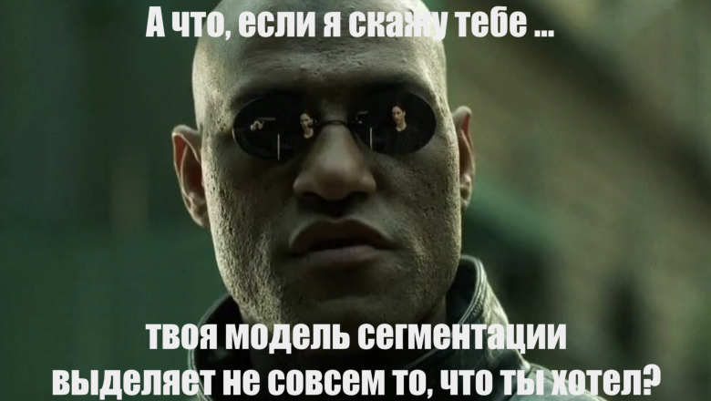

# FaceSegmentation

### Задание

Предлагается решить задачу семантической сегментации атрибутов лица человека. В качестве датасета будет использоваться [CelebAMask-HQ](https://github.com/switchablenorms/CelebAMask-HQ). Выборка из датасета представлена в [файле](train_test_split-10e5aa2b-26ae-4110-b7a6-2beed2c7da6a.csv).

В этом репозитории представлено моё решение задачи.

### Проведённая работа

Так как даже в 512x512 сложно что-либо делать с картинками, не перегружая оперативку колаба, пришлось уменьшить разрешение до 128x128.

В [ноутбуке](faces.ipynb) находится подробное описание построенных моделей. Для решения задачи используется библиотека `segmentation_models`. В качестве архитектуры выбрана Unet, в которую загружены предобученные веса. Модель обучалась определять класс `hair`. Результаты работы можно увидеть в ноутбуке, обученная модель достаточно правильно выделяет области в большинстве не слишком сложных случаев. Если продолжить обучение, вероятно, получится довольно точный алгоритм.

### Воспроизведение кода

Чтобы воспроизвести выполнение кода, нужно:

0. Убедиться в том, что у вас установлен `Python3` и библиотеки из [`requirements.txt`](requirements.txt).
1. Скачать датасет [CelebAMask-HQ](https://github.com/switchablenorms/CelebAMask-HQ) и распаковать.
2. В той же директории выполнить код из [файла](preprocess.py), после этого будет создана новая директория `CelebAMask` с выборкой картинок для обучения, сжатых до размер 128x128.
3. Выполнить [ноутбук](faces.ipynb).

### Результаты

